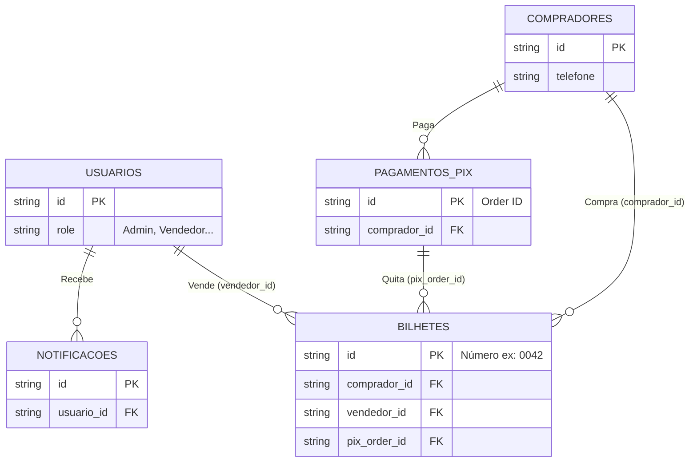

# Modelagem de Dados

Este diretório contém a documentação da arquitetura de dados do sistema, que utiliza **Firebase Cloud Firestore** (NoSQL) e **Cloud Storage**.

## Princípios de Modelagem

1. **Desnormalização para Leitura**: O Firestore penaliza múltiplas leituras simultâneas para junções de dados (joins). Por isso, dados vitais frequentemente acessados juntos (ex: O nome e telefone do `comprador` que comprou um `bilhete`) são propagados e repetidos (*desnormalizados*) entre as coleções. O backend se encarrega de manter essa coerência.
2. **Consistência via Transações**: Como dados vitais financeiros estão desnormalizados, as operações de venda, baixa e alteração crítica de *status* SEMPRE ocorrem por meio de `runTransaction` (garantia ACID).
3. **Snake_case vs CamelCase**: O banco é modelado nativamente com chaves em `snake_case`, de modo a diferenciar das propriedades tipicamente computadas pelo front e back que transitam nos DTOs sob `camelCase`.

## Diagrama Entidade-Relacionamento (ER Lógico)

Apesar de ser um banco NoSQL (orientado a documentos), existem *relações lógicas* (chaves de IDs que referenciam outros documentos) essenciais para compreender o sistema:

## Navegação

Consulte os guias abaixo para detalhamentos específicos:
- [Coleções (Dicionários de Dados)](colecoes/) - Detalhamento campo a campo das principais coleções.
- [Máquinas de Estado](estados.md) - Fluxo de transição dos bilhetes e validações Pix.
- [Mapa de Desnormalização](desnormalizacao.md) - Rastreio de quais campos são copiados.
- [Invariantes e Transações ACID](invariantes.md) - Leis de consistência da infraestrutura financeira.
- [Índices e Consultas](indices-e-consultas.md) - Como a API pesquisa dados.
