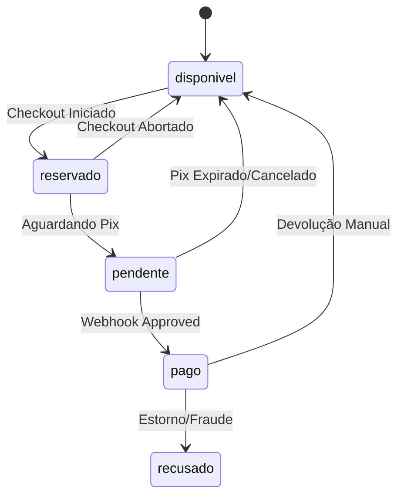
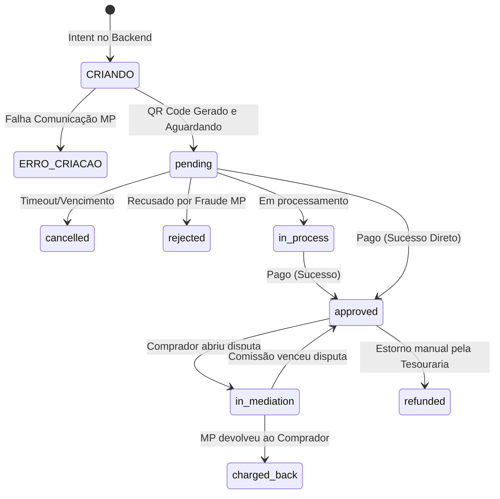
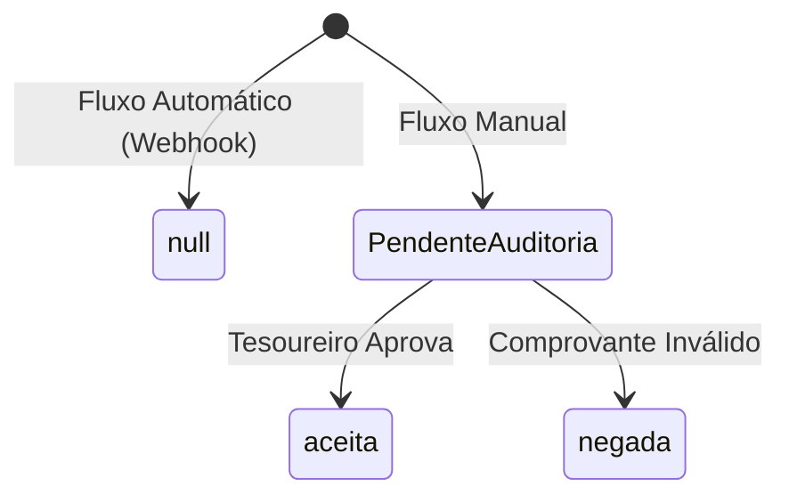

# Máquinas de Estado

O ciclo de vida das transações financeiras é gerido por três máquinas de estado paralelas e interconectadas. Este documento ilustra os fluxos que um `bilhete` e um `pagamento_pix` podem sofrer.

## 1. Status Principal do Bilhete (`Bilhete.status`)

Este é o estado núcleo (financeiro) da rifa. Ele determina a posse do bilhete.

### A flag ortogonal: `correcao_pendente`
A necessidade de reenvio de um nome ou erro no e-mail **NÃO** afeta a máquina acima. O status financeiro (`pago`) permanece intacto. Um bilhete com problemas cadastrais apenas recebe a flag booleana `correcao_pendente = true`, sinalizando à UI que o aderido precisa atuar, mas o dinheiro já está na conta.

---

## 2. Status do Pagamento Pix (`PagamentoPix.status_pagamento_banco`)

Este estado espelha fielmente a topologia devolvida pela API do Mercado Pago, gerindo não só a vida útil do QR Code, mas os contenciosos pós-pagamento.

### Retrocompatibilidade (Estados Legados)
O código e o dicionário de dados mantém suporte estrutural à leitura de eventos legados com grafia MAIÚSCULA, resultantes de uma infraestrutura anterior. São eles:
- `PAID` (equivalente a *approved*)
- `WAITING` (equivalente a *pending*)
- `CANCELED` (equivalente a *cancelled*)
- `DECLINED` / `IN_ANALYSIS` (equivalente a *rejected* / *in_process*)

---

## 3. Status de Validação da Tesouraria (`status_validacao`)

Antigamente (antes do webhook Pix), o vendedor enviava o comprovante manual de transferência, que ia para a fila da Tesouraria aprovar ou não. 

> [!TIP]
> Compras recentes feitas puramente por QR Code Pix não utilizam mais este fluxo, preenchendo automaticamente com `"aceita"` ou sendo validadas pelo `status_pagamento_banco`. O fluxo manual permanece para retrocompatibilidade ou casos excepcionais de quebra de webhook.
