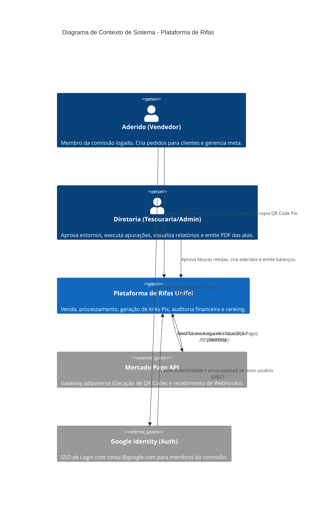

# Arquitetura e Fluxos do Sistema

Bem-vindo à Fase 2. A documentação arquitetural deste sistema utiliza a metodologia **C4 Model** (Containers e Componentes), UML para os **Casos de Uso** e Diagramas de Sequência (Mermaid) para os **Fluxos de Negócio**.

Navegue pelas pastas de acordo com o nível de abstração que deseja estudar:

- 🏗️ **[C4 Model](./c4-model/)**: Diagramas estruturais estáticos (Quais as caixas do sistema e como elas se comunicam via rede e código).
- 🧑‍💻 **[Casos de Uso](./casos-de-uso/)**: Diagramas comportamentais focados no Ator. O que cada perfil de usuário pode ou não fazer.
- ⏱️ **[Fluxos de Negócio](./fluxos-de-negocio/)**: Diagramas de sequência temporais. Qual o caminho passo-a-passo e condicional de uma ação, como compras ou auditorias.

---

## Visão Geral: C4 Nível 1 (Contexto de Sistema)

Para iniciar, este é o *System Context diagram*. Ele abstrai as engrenagens internas e exibe apenas os Atores e os Sistemas Externos com os quais nosso software conversa diretamente.

