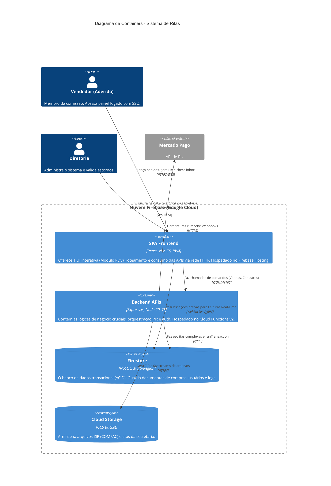

# C4 Model: Nível 2 (Containers)

No Nível 2 do C4 Model, nós damos um zoom na caixa principal (`Sistema de Rifas Unifei`) e enxergamos as sub-aplicações físicas e infraestrutura que compõem nossa solução. O sistema utiliza a stack de Nuvem Serverless do Firebase (GCP).

