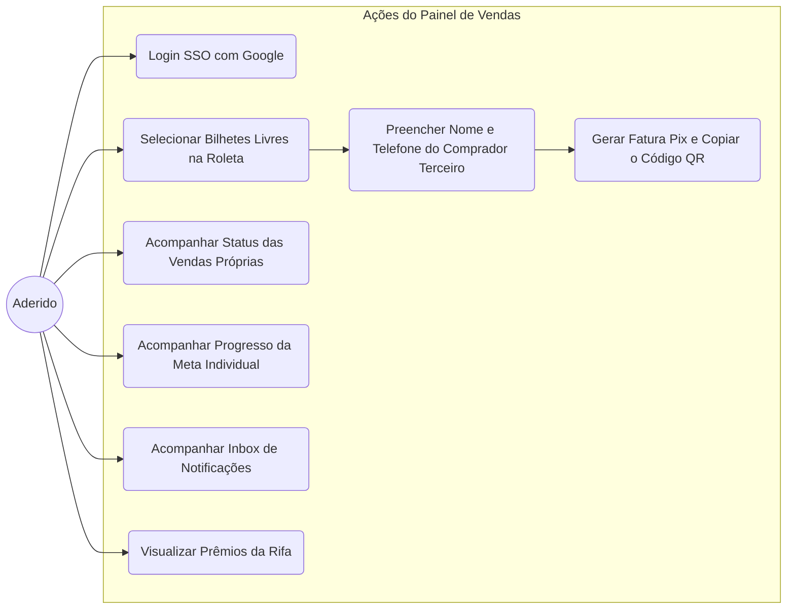

# Casos de Uso: Aderido (Vendedor do PDV)

O sistema de rifas não é uma loja pública. Ele funciona como um **Ponto de Venda Privado**, onde apenas o Aderido (Membro da comissão autenticado) tem acesso. O Aderido vende ativamente para o cliente final (amigos, familiares) pelo WhatsApp ou boca-a-boca, cadastra os dados no painel e repassa a cobrança gerada para que o cliente pague.

