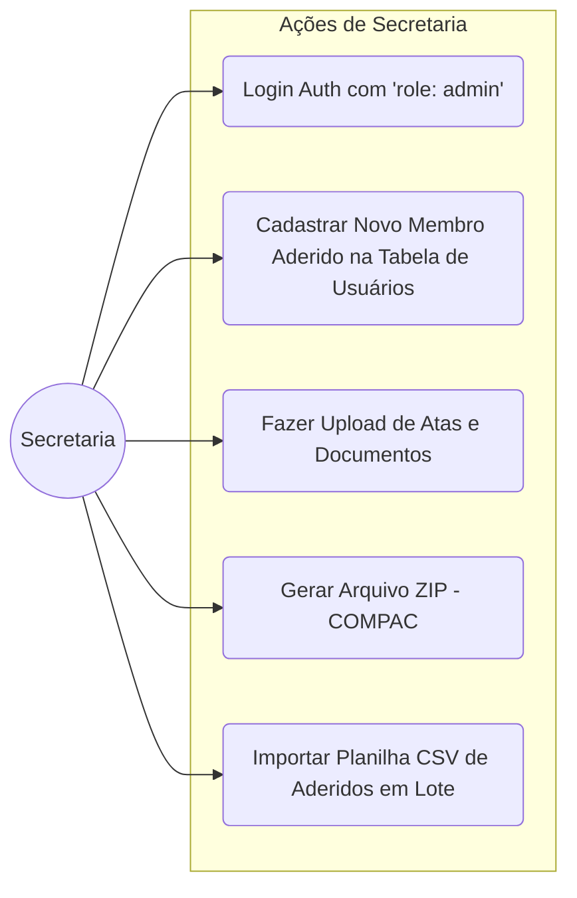

# Casos de Uso: Secretaria

A Secretaria é o nível máximo de privilégio administrativo. Eles cuidam da entrada de novos membros e das burocracias jurídicas, como atas de reunião e relatórios legais.

