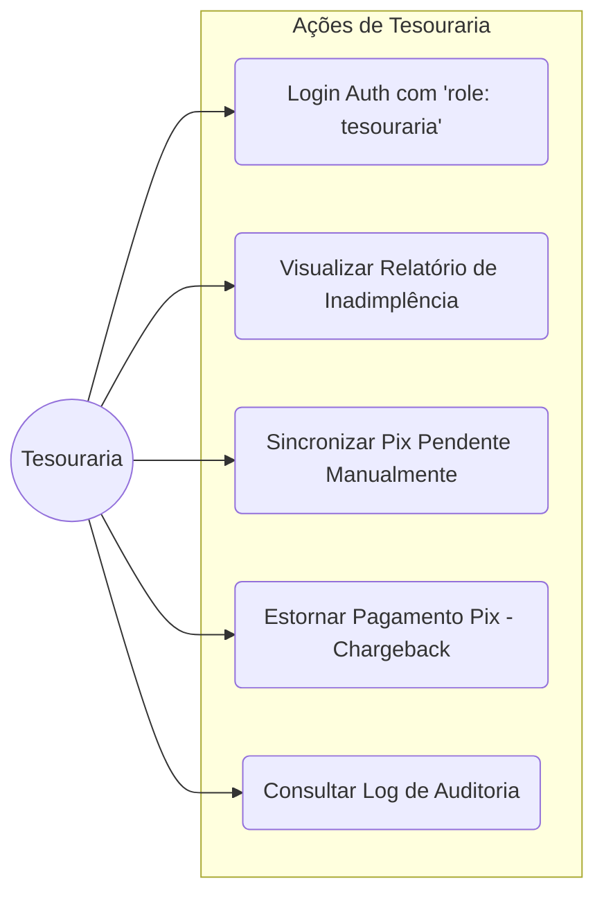

# Casos de Uso: Tesouraria

A Tesouraria opera num nível acima do Aderido. Se o Aderido é o "Vendedor", a Tesouraria é o "Gerente do Banco", lidando com disputas, fraudes e conciliações anômalas (aquelas que o Webhook do Mercado Pago não conseguiu resolver automaticamente).

