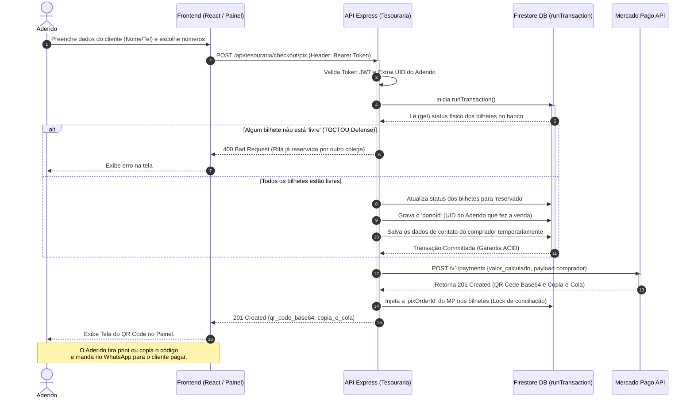

# Fluxo 01: Geração de Venda Pix (PDV)

O grande desafio desta arquitetura é o ambiente de alta concorrência. Se dois Aderidos tentarem reservar a rifa "0042" exatamente no mesmo milissegundo para os seus respectivos clientes, a transação ACID trava o segundo vendedor no Banco de Dados antes mesmo dele disparar o Pix no Mercado Pago.

Vale lembrar que quem faz a venda é o **Aderido** (autenticado), inserindo os dados do Terceiro (Comprador final).

