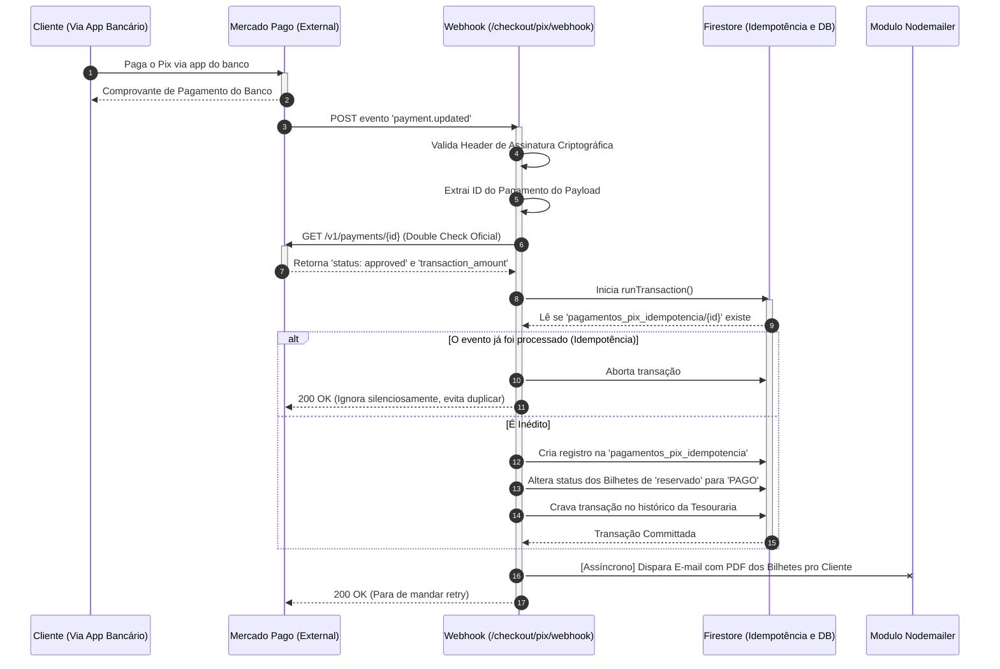

# Fluxo 02: Conciliação Automática via Webhook

Uma vez que o Aderido repassa o Pix gerado e o cliente o paga no seu aplicativo de banco, o Mercado Pago precisa avisar o nosso backend de que o dinheiro caiu. Ele faz isso de forma invisível, batendo num endpoint público da nossa API (o Webhook).

Neste meio tempo, as rifas ficaram no estado `reservado` para que ninguém mais as compre. As cobranças têm validade (normalmente 5 minutos) para evitar trancar bilhetes para sempre. 

O perigo principal do Webhook é a **retentativa (retry)**: O Mercado Pago às vezes manda o mesmo webhook duas vezes por instabilidade. Por isso, usamos o padrão de Idempotência.

