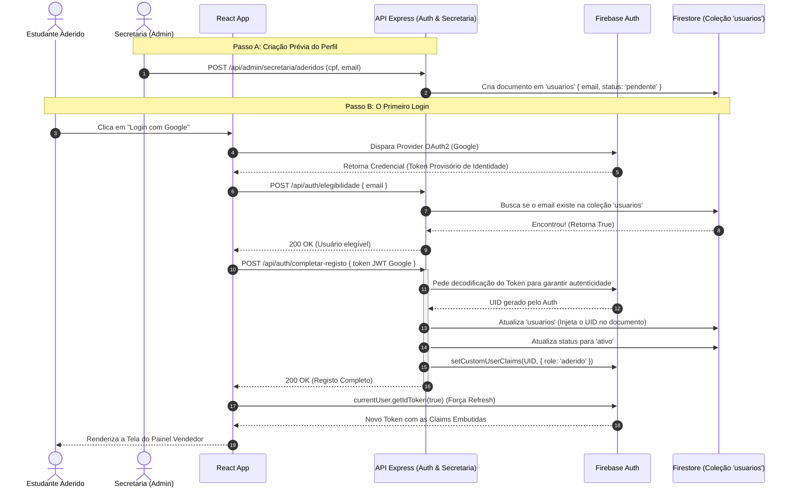

# Fluxo 03: Onboarding de Aderidos e Custom Claims

A segurança e os níveis de permissão do sistema não utilizam coleções avulsas para controlar papéis de sistema. Usamos **Firebase Custom Claims**. Para que um membro da comissão tenha acesso, ele deve ser primeiro "adicionado" pela Secretaria, o que gera o perfil dele.

