# Fluxo 04: Compactação (COMPAC) de Documentos

A "COMPAC" refere-se à ferramenta administrativa de criação de "Pacotes ZIP". Ela permite que os membros da Secretaria (Admin) solicitem o agrupamento de múltiplos documentos sensíveis hospedados na nuvem em um único arquivo compactado baixável.

```mermaid
sequenceDiagram
    autonumber
    actor Admin
    participant SPA as Frontend (React)
    participant API as Backend (Express)
    participant Disk as Servidor (File System)
    participant Cloud as Firebase Storage

    Admin->>SPA: Seleciona as Atas/Docs e clica "Baixar Pacote"
    SPA->>API: POST /api/admin/compac/compactar { nomePacote, ficheiros: [...] }
    
    activate API
    API->>API: Valida Token, Claims de Secretaria e Payload

    loop Para cada ficheiro na lista
        API->>Cloud: Pede Buffer/Stream do Arquivo Remoto
        activate Cloud
        Cloud-->>API: Entrega o Binário
        deactivate Cloud
        API->>Disk: Usa 'archiver' para empacotar dentro do ZIP local
    end

    API->>Disk: Finaliza a stream e cria "nomePacote.zip"
    
    API-->>SPA: 200 OK + Transferência de Stream (res.download)
    
    SPA->>Admin: O navegador inicia o download do arquivo ZIP
    
    API->>Disk: fs.unlink(caminhoFicheiroGerado) - Limpa o lixo
    deactivate API
```

